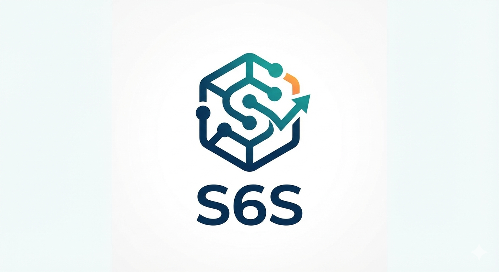

# s6s Workflow Automation Platform

s6s is a self-hosted, secure, and open-source enterprise workflow automation platform designed for high-compliance environments. It enables organizations to orchestrate complex business logic through a visual interface while maintaining strict governance over data and credentials.

## Architecture Overview

The platform is engineered as a high-performance monorepo using Turborepo, ensuring modularity and type safety across the full stack.

*   **Execution Model**: s6s utilizes an asynchronous Producer/Consumer architecture. The frontend triggers execution events which are queued in Redis via BullMQ. Dedicated worker services consume these jobs, ensuring the main application remains responsive even under heavy load.
*   **Security-First Design**: Unlike standard automation tools, s6s prioritizes security. The architecture includes a dedicated Vault service that enforces a hybrid cryptographic scheme combining AES-256-GCM and Post-Quantum Cryptography (ML-KEM-1024) for all stored credentials at rest. Secrets are decrypted only in-memory within the isolated execution context and are never exposed to the frontend client.
*   **Sandboxed Execution**: Custom code nodes run within isolated virtual machine contexts to prevent remote code execution vulnerabilities and ensure tenant isolation.

## Key Features

### Visual Workflow Editor
A sophisticated drag-and-drop canvas built on React Flow allows users to design complex directed acyclic graphs (DAGs). The editor supports branching logic, parallel execution paths, and real-time validation of node configurations.

### Secure Vault
The platform includes a built-in Credential Manager that handles sensitive data (API keys, database passwords, certificates). All secrets are encrypted using a hybrid approach: standard AES-256-GCM for speed and compatibility, augmented by ML-KEM-1024 (Kyber) for quantum-resistance. This ensures data remains secure even against future "harvest now, decrypt later" attacks by quantum computers. Access to credentials is governed by strict Role-Based Access Control (RBAC) policies.

### Post-Quantum Cryptography (PQC)
s6s is one of the first automation platforms to integrate NIST-standardized Post-Quantum Cryptography.
*   **Algorithm**: ML-KEM-1024 (formerly Kyber-1024).
*   **Implementation**: Hybrid encryption model where data is secured by both classical and quantum-resistant algorithms.
*   **Future-Proofing**: Protects long-lived credentials against the threat of future quantum decryption capabilities.

### Scalable Execution Engine
The backend engine is designed for horizontal scalability. It supports a wide range of node types including:
*   **Triggers**: Webhooks, Cron Schedules, Polling events.
*   **Actions**: HTTP Requests, Database Queries (PostgreSQL), Email (SMTP), Cloud Storage (AWS/Azure/GCP), and LLM Integrations.
*   **Logic**: Conditional branching (If/Else), Merges, and Loops.

### Dynamic Linking & Expression Resolution
Nodes support dynamic data referencing. Output from any previous step in the workflow can be injected into subsequent nodes using the template syntax `{{ $node["StepName"].json.outputKey }}`. These expressions are resolved at runtime, allowing for powerful data transformation pipelines.

## Technology Stack

*   **Runtime**: Node.js (v20+)
*   **Language**: TypeScript (Strict Mode)
*   **Frameworks**: NestJS (Backend), React (Frontend)
*   **Cryptography**: crystals-kyber-js (ML-KEM), Node.js Crypto
*   **Database**: PostgreSQL
*   **Queue & Caching**: Redis, BullMQ
*   **Infrastructure**: Docker, Turborepo

## Getting Started

### Prerequisites

Ensure the following are installed on your development environment:
*   Node.js v20 or higher
*   Docker and Docker Compose
*   PostgreSQL (local or remote instance)

### Local Development Setup

1.  **Install Dependencies**
    ```bash
    npm install
    ```

2.  **Database Initialization**
    Generate the Prisma client and push the schema to your local database.
    ```bash
    npx prisma generate
    npx prisma db push
    ```

3.  **Start Development Server**
    Launch the full stack (Frontend, Backend, and Workers) in development mode.
    ```bash
    npx turbo run dev
    ```

    The application will be available at `http://localhost:5173`.

## Deployment

s6s is designed with a Docker-first approach. The repository includes optimized Dockerfiles for each service. It is fully compatible with container orchestration platforms such as Kubernetes, AWS App Runner, and AWS Amplify.

For production deployments, ensure that the `ENCRYPTION_KEY` environment variable is set securely and backed up, as losing this key will render all stored credentials unrecoverable.

## Contributors
Thanks to Leopold and Robert for the hints.
